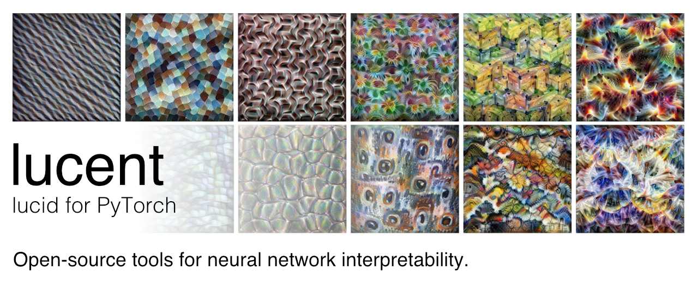

# Lucent

<!--*It's still magic even if you know how it's done. GNU Terry Pratchett*-->

[](https://travis-ci.org/greentfrapp/lucent)
[](https://coveralls.io/github/greentfrapp/lucent)

[Lucid](https://github.com/tensorflow/lucid) library adapted for PyTorch.

To quote Lucid:

**Lucent is research code, not production code. We provide no guarantee it will work for your use case.**

# Usage

Lucent is still in pre-alpha phase and can be installed locally with the following command:

```
pip install git+https://github.com/greentfrapp/lucent.git
```

In the spirit of Lucid, get up and running with Lucent immediately, thanks to [Colaboratory](https://colab.research.google.com/notebooks/welcome.ipynb)! 

You can also clone this repository and run the notebook locally with the [Jupyter notebook environment](http://jupyter.org/install.html).

## Tutorial

<a href="https://colab.research.google.com/github/greentfrapp/lucent/blob/master/notebooks/tutorial.ipynb">
</img>
</a>

# Recomended Reading

* [Feature Visualization](https://distill.pub/2017/feature-visualization/)
* [The Building Blocks of Interpretability](https://distill.pub/2018/building-blocks/)
* [Using Artificial Intelligence to Augment Human Intelligence](https://distill.pub/2017/aia/)
* [Visualizing Representations: Deep Learning and Human Beings](http://colah.github.io/posts/2015-01-Visualizing-Representations/)
* [Differentiable Image Parameterizations](https://distill.pub/2018/differentiable-parameterizations/)
* [Activation Atlas](https://distill.pub/2019/activation-atlas/)

## Related Talks
* [Lessons from a year of Distill ML Research](https://www.youtube.com/watch?v=jlZsgUZaIyY) (Shan Carter, OpenVisConf)
* [Machine Learning for Visualization](https://www.youtube.com/watch?v=6n-kCYn0zxU) (Ian Johnson, OpenVisConf)

# Slack

Check out the Lucid community at `#proj-lucid` on the Distill slack ([join link](http://slack.distill.pub))!

# Additional Information

## License and Disclaimer

You may use this software under the Apache 2.0 License. See [LICENSE](LICENSE).
